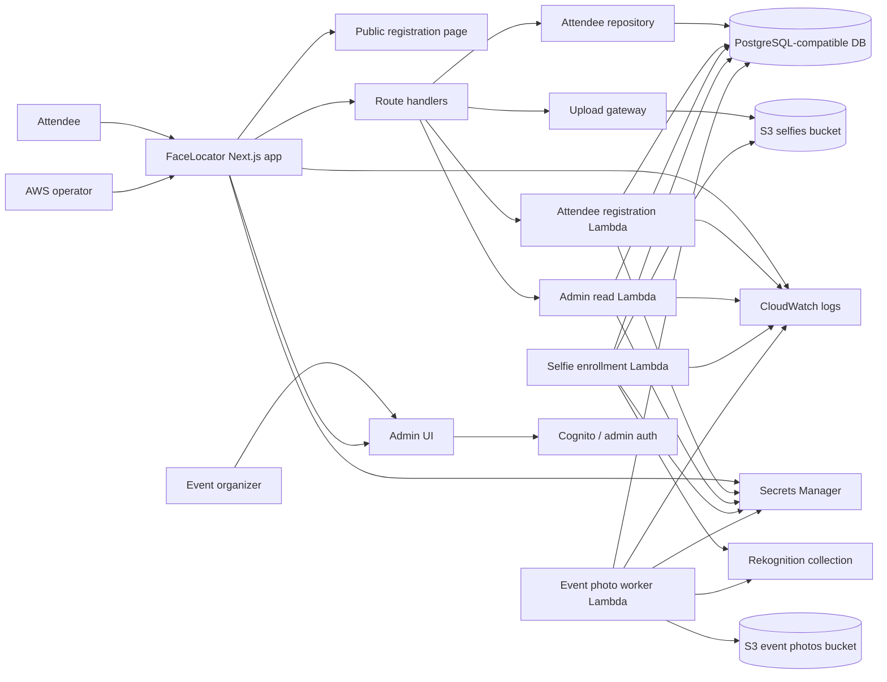
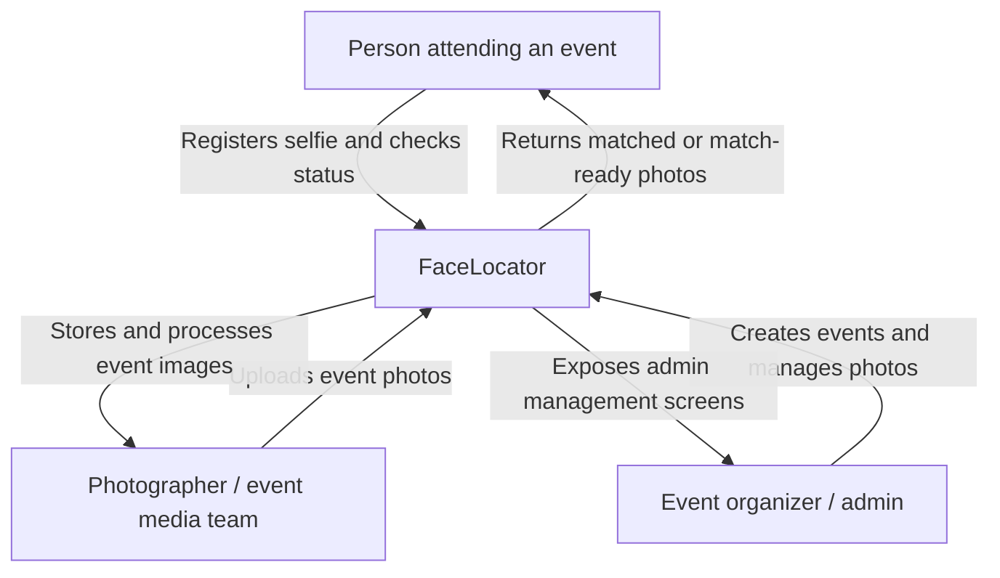
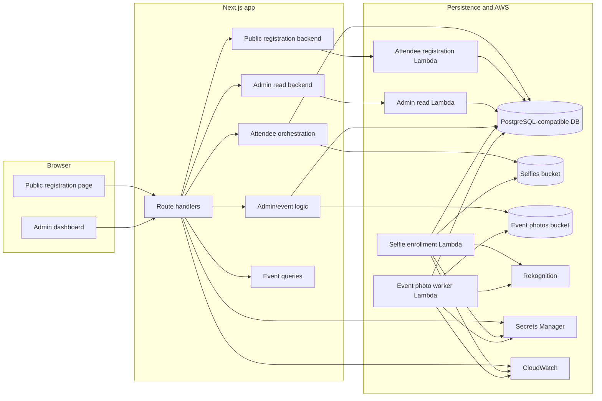
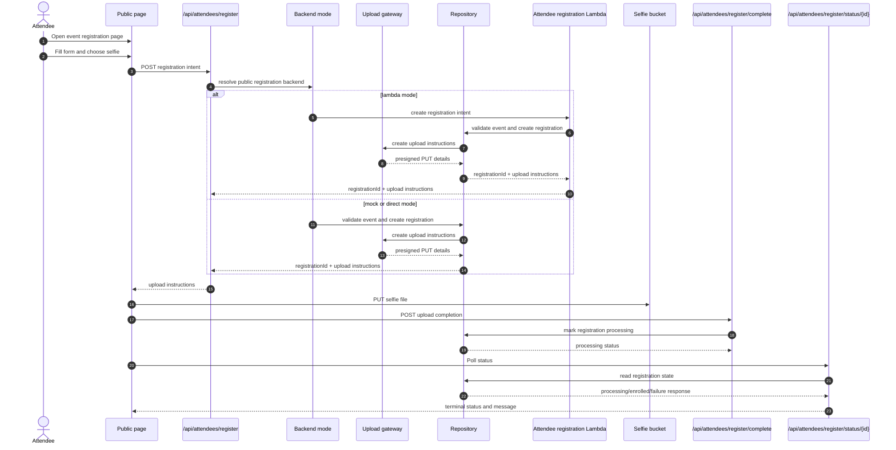
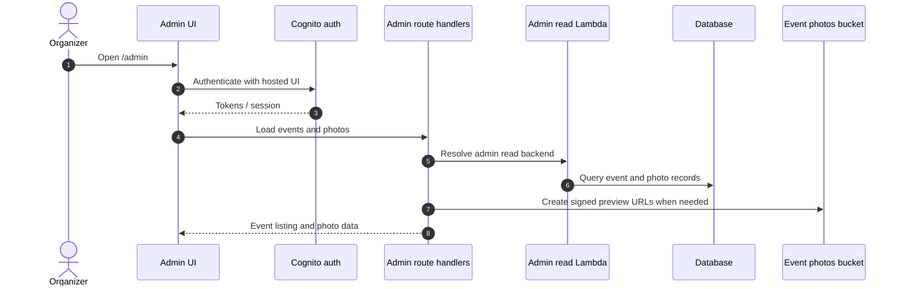
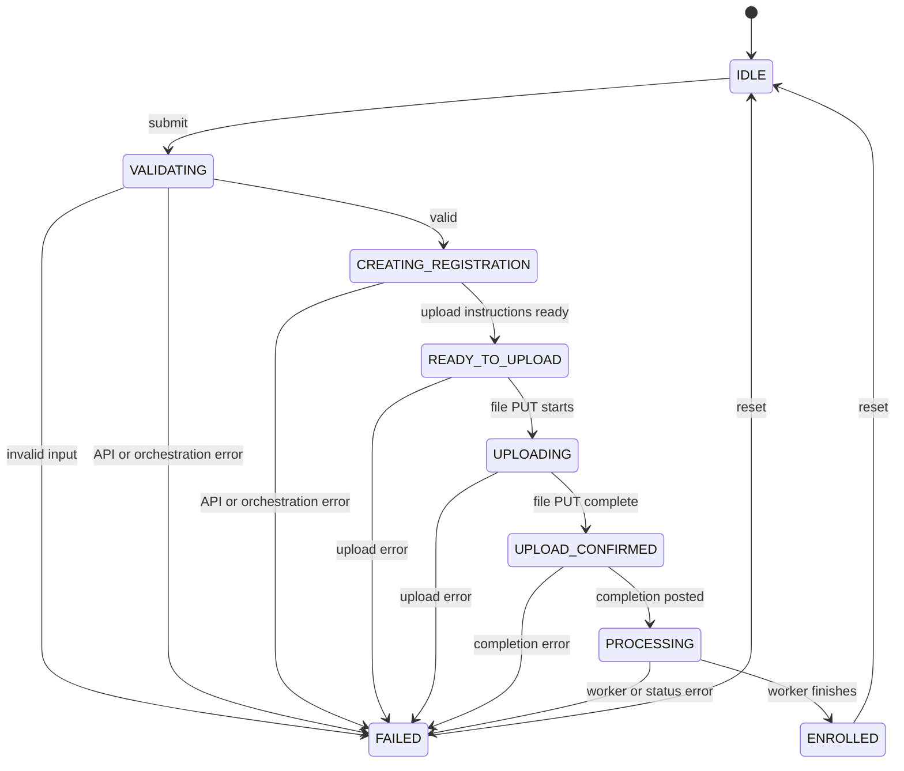
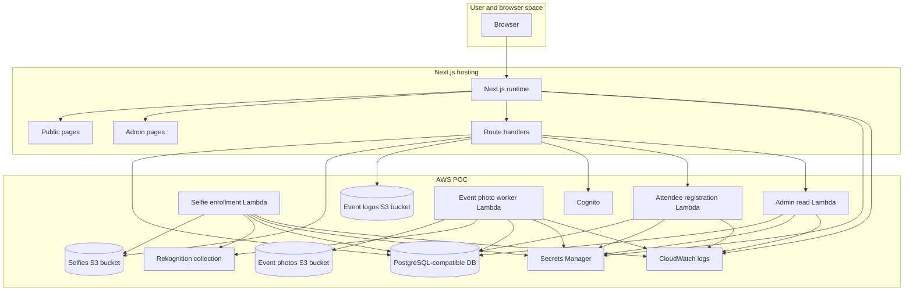

# FaceLocator

[](https://deepwiki.com/anyulled/facelocator)

FaceLocator is a Next.js-based event photography enrollment and delivery scaffold. Attendees register a selfie for an event, the app issues an upload instruction, and the backend moves the registration through a small, explicit state machine until the attendee is enrolled and ready for matching.

The repo is intentionally split into two layers:

- The runnable Next.js app at the repository root
- The design and AWS POC guidance under `specs/` and `docs/`

This README is meant to help both humans and AI agents understand the codebase quickly, find the right seam to change, and contribute without widening the AWS or product scope by accident.

## What This Project Does

- Presents a public event enrollment page
- Accepts attendee name, email, consent, and selfie upload intent
- Issues upload instructions through a gateway abstraction
- Tracks registration status through `UPLOAD_PENDING`, `PROCESSING`, `ENROLLED`, `FAILED`, and `CANCELLED`
- Exposes admin pages for event and photo management
- Routes public registration and admin reads through explicit backend modes so the app can run in mock mode or through VPC-attached Lambdas when the database is private
- Keeps the AWS-backed pieces behind explicit boundaries so the app can still run in mock mode

## System Landscape



## C4 Context



## C4 Containers



## Main Request Flow



## Admin Flow



## Enrollment State Machine



## Infrastructure View



## Repository Layout

- `app/` - Next.js App Router pages and route handlers
- `components/` - Client and admin UI components
- `lib/attendees/` - enrollment contracts, orchestration, repository abstraction, validation, telemetry, and state machine
- `lib/admin/` - admin auth and event/photo operations
- `lib/aws/` - AWS boundary helpers and database wiring
- `lambdas/` - AWS Lambda worker packages
- `docs/` - operational and boundary documentation
- `specs/` - ticket packs and design guidance
- `tests/` - unit and end-to-end tests

## Key Code Paths

- Public landing page: [`app/page.tsx`](/Users/anyulled/IdeaProjects/FaceLocator/app/page.tsx)
- Event registration page: [`app/events/[eventSlug]/register/page.tsx`](/Users/anyulled/IdeaProjects/FaceLocator/app/events/[eventSlug]/register/page.tsx)
- Enrollment form: [`components/events/attendee-enrollment-form.tsx`](/Users/anyulled/IdeaProjects/FaceLocator/components/events/attendee-enrollment-form.tsx)
- Enrollment API routes: [`app/api/attendees/register/route.ts`](/Users/anyulled/IdeaProjects/FaceLocator/app/api/attendees/register/route.ts), [`app/api/attendees/register/complete/route.ts`](/Users/anyulled/IdeaProjects/FaceLocator/app/api/attendees/register/complete/route.ts), [`app/api/attendees/register/status/[registrationId]/route.ts`](/Users/anyulled/IdeaProjects/FaceLocator/app/api/attendees/register/status/[registrationId]/route.ts)
- Attendee orchestration: [`lib/attendees/orchestrator.ts`](/Users/anyulled/IdeaProjects/FaceLocator/lib/attendees/orchestrator.ts)
- State machine: [`lib/attendees/state-machine.ts`](/Users/anyulled/IdeaProjects/FaceLocator/lib/attendees/state-machine.ts)
- Mock and Postgres repositories: [`lib/attendees/repository.ts`](/Users/anyulled/IdeaProjects/FaceLocator/lib/attendees/repository.ts), [`lib/attendees/postgres-repository.ts`](/Users/anyulled/IdeaProjects/FaceLocator/lib/attendees/postgres-repository.ts)
- AWS boundary contract: [`lib/aws/boundary.ts`](/Users/anyulled/IdeaProjects/FaceLocator/lib/aws/boundary.ts)
- Admin surfaces: [`app/admin/page.tsx`](/Users/anyulled/IdeaProjects/FaceLocator/app/admin/page.tsx), [`app/admin/events/page.tsx`](/Users/anyulled/IdeaProjects/FaceLocator/app/admin/events/page.tsx)

## Runtime Modes

The app currently supports two repository modes:

- `FACE_LOCATOR_REPOSITORY_TYPE=postgres` uses the PostgreSQL-backed repository
- Any other value uses the in-memory repository

Upload behavior is controlled by the AWS upload gateway configuration:

- Mock mode is used when AWS upload environment variables are absent
- AWS mode is used when the presigned upload environment is present

The boundary variables are listed in [`lib/aws/boundary.ts`](/Users/anyulled/IdeaProjects/FaceLocator/lib/aws/boundary.ts) and the Next.js boundary contract in [`docs/aws-nextjs-boundary.md`](/Users/anyulled/IdeaProjects/FaceLocator/docs/aws-nextjs-boundary.md)

## Local Development

```bash
pnpm install
pnpm dev
```

Open [http://localhost:3000](http://localhost:3000), then visit `/events/speaker-session-2026/register` to exercise the sample enrollment flow.

## Useful Commands

```bash
pnpm lint
pnpm test
pnpm test:e2e
pnpm build
```

## Environment Variables

The most important runtime variables are:

- `FACE_LOCATOR_REPOSITORY_TYPE`
- `FACE_LOCATOR_AWS_UPLOAD_MODE`
- `ADMIN_READ_BACKEND`
- `PUBLIC_REGISTRATION_BACKEND`
- `FACE_LOCATOR_SELFIES_BUCKET`
- `FACE_LOCATOR_EVENT_PHOTOS_BUCKET`
- `FACE_LOCATOR_EVENT_LOGOS_BUCKET`
- `FACE_LOCATOR_PUBLIC_BASE_URL`
- `FACE_LOCATOR_DATABASE_SECRET_NAME`
- `FACE_LOCATOR_DATABASE_SECRET_ARN`
- `FACE_LOCATOR_ADMIN_EVENTS_READ_LAMBDA_NAME`
- `FACE_LOCATOR_ATTENDEE_REGISTRATION_LAMBDA_NAME`
- `FACE_LOCATOR_MATCHED_PHOTO_NOTIFIER_LAMBDA_NAME`
- `AWS_REGION`
- `MATCH_LINK_SIGNING_SECRET`
- `MATCH_LINK_TTL_DAYS`
- `SES_FROM_EMAIL`

If AWS upload variables are omitted, the app remains in mock-backed mode so local development stays simple.

## AWS POC Boundaries

The AWS POC is intentionally narrow. The accepted surface area is documented in:

- [`docs/aws-poc-scope.md`](/Users/anyulled/IdeaProjects/FaceLocator/docs/aws-poc-scope.md)
- [`docs/aws-iam-bootstrap.md`](/Users/anyulled/IdeaProjects/FaceLocator/docs/aws-iam-bootstrap.md)
- [`docs/aws-database-boundary.md`](/Users/anyulled/IdeaProjects/FaceLocator/docs/aws-database-boundary.md)
- [`docs/aws-retention-and-delete.md`](/Users/anyulled/IdeaProjects/FaceLocator/docs/aws-retention-and-delete.md)
- [`docs/aws-encryption.md`](/Users/anyulled/IdeaProjects/FaceLocator/docs/aws-encryption.md)
- [`docs/aws-nextjs-boundary.md`](/Users/anyulled/IdeaProjects/FaceLocator/docs/aws-nextjs-boundary.md)
- [`docs/aws-amplify-deployment.md`](/Users/anyulled/IdeaProjects/FaceLocator/docs/aws-amplify-deployment.md)
- [`docs/aws-operator-runbook.md`](/Users/anyulled/IdeaProjects/FaceLocator/docs/aws-operator-runbook.md)
- [`docs/aws-verification-checklist.md`](/Users/anyulled/IdeaProjects/FaceLocator/docs/aws-verification-checklist.md)

Do not add AWS resources unless they map directly to a ticket in `specs/aws_poc_ticket_pack`.

## How The Code Is Organized

The enrollment flow is deliberately split into small seams:

- `contracts.ts` defines request and response shapes
- `schemas.ts` validates incoming form and API payloads
- `state-machine.ts` defines the UI state machine
- `orchestrator.ts` coordinates client-side registration, upload, completion, and polling
- `repository.ts` is the in-memory seam used during scaffolding
- `postgres-repository.ts` is the database-backed seam for the AWS path
- `upload-gateway.ts` is the presigned upload abstraction
- `telemetry.ts` is a stubbed event tracking seam
- `rate-limit.ts` is the throttling decision point

That split is the main thing contributors should preserve when adding new behavior.

## Contribution Guide

### For humans

- Make the smallest change that proves the behavior
- Add or update tests near the seam you touched
- Keep AWS-specific logic behind the boundary modules instead of spreading it through UI code
- Prefer explicit contracts and deterministic state transitions over hidden side effects
- Update the relevant docs when the architecture or operational path changes
- Keep the README architecture diagrams aligned with the actual runtime paths, especially when backend modes or Lambda boundaries change

### For AI agents

- Read the repo shape before editing
- Keep the public page, attendee flow, admin flow, and AWS boundary concepts distinct
- If you change the request/response shape, update the contracts, schema, orchestrator, and tests together
- If you change AWS behavior, update the matching docs in `docs/`
- Preserve the mock path unless the task explicitly requires the AWS path
- Do not widen scope by introducing new infrastructure without a direct reason

## Verification Checklist

Before landing changes, verify:

1. The README diagrams still match the actual request flow and modules
2. `pnpm lint` passes
3. `pnpm test` passes
4. `pnpm build` passes when the change affects runtime code
5. Any AWS change is reflected in the boundary docs and operator notes

## Sample Event

The sample event used by the scaffold is:

- slug: `speaker-session-2026`
- title: `DevBcn 2026`
- venue: `World Trade Center, Barcelona`

That event is wired through the event queries helper and the registration page so the sample path stays easy to test.
